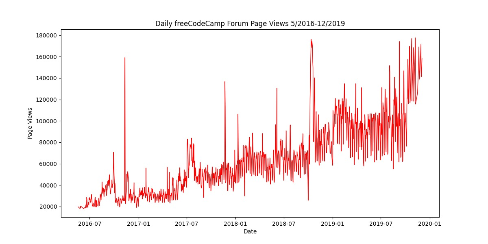
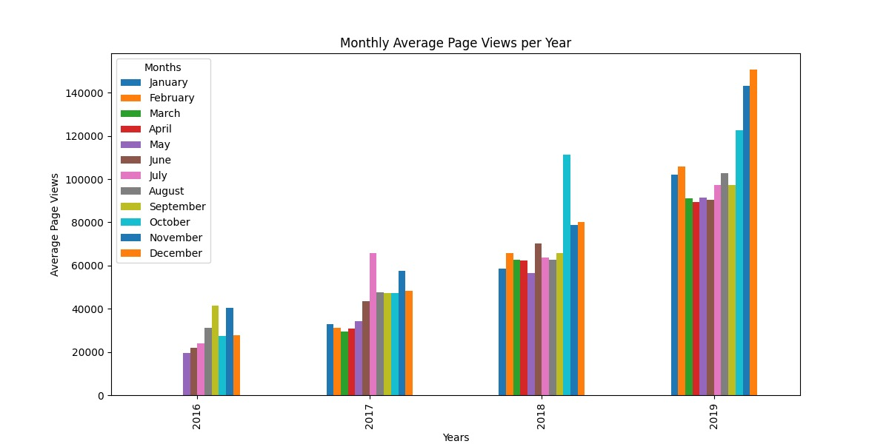
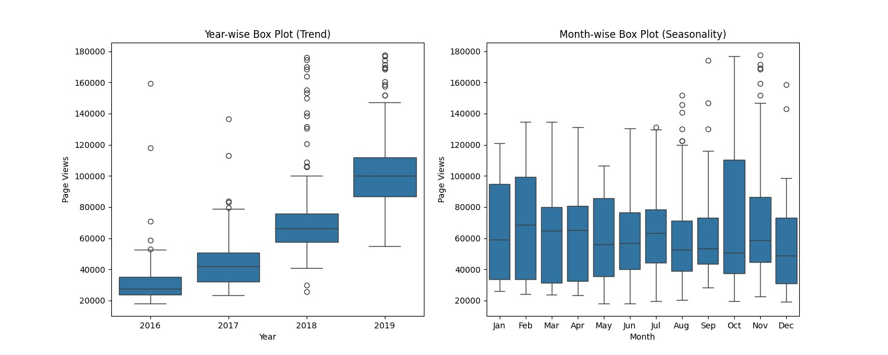

# Data-Analysis-project-FCC---Page-View-Time-Series-Visualizer

### Description
In this project, a dataset of page views on the freeCodeCamp Forum was analyzed to create visualizations that help understand trends and seasonality in the data. The visualizations include:
- A line plot showing daily page views over time.
- A bar plot showing monthly average page views per year.
- Box plots showing distributions of page views by year and by month.

### Key Features
- Data manipulation and cleaning using **Pandas**.
- Interactive and visually appealing plots created with **Matplotlib** and **Seaborn**.
- Use of statistical methods to filter outliers from the dataset.

### Files
- `time_series_visualizer.py`: Python script containing all functions for generating the visualizations.
- `test_module.py`: Test cases to validate the implementation of visualizations.

### Visualizations
Below are examples of the visualizations created:
1. **Line Plot**: Displays the overall trend of daily page views.
2. **Bar Plot**: Shows the monthly average page views for each year.
3. **Box Plot**: Highlights the distributions and trends in page views by year and by month.

### Example Outputs
**Line Plot**  


**Bar Plot**  


**Box Plot**  


---

## How to Run
1. Ensure you have Python installed (version 3.8 or later is recommended).
2. Install the required libraries using `pip`:
   ```bash
   pip install pandas matplotlib seaborn

---

## License
This repository is licensed under the MIT License. Feel free to use and modify the code as needed.

---

## Acknowledgements
Special thanks to the learning resources and mentors who guided this project.
